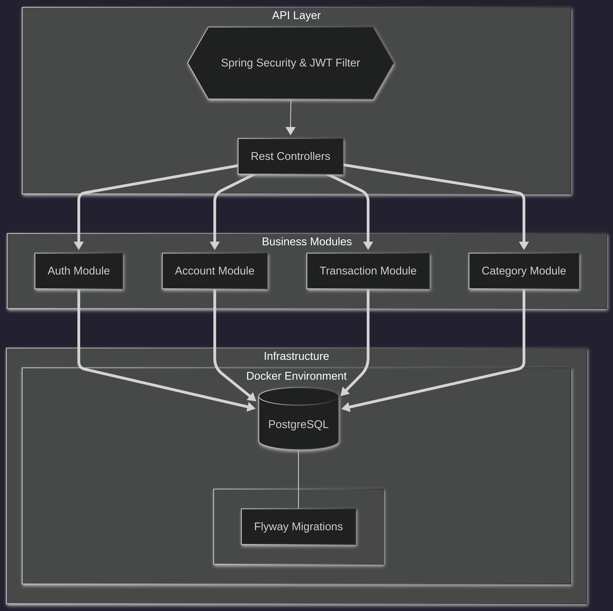

# Documentação Técnica e Arquitetura: FinUp

## 1. Estratégia Arquitetural

O projeto utiliza um **Monólito Modular Evolutivo**. Esta decisão visa a simplicidade operacional inicial sem sacrificar a possibilidade de migração para microsserviços, garantindo que os domínios (Account, Transaction, User) possuam baixo acoplamento.

A evolução arquitetural planejada segue as seguintes etapas:

1. Monólito modular simples
2. Integrações externas (agregadores e Open Finance)
3. Automação financeira (sincronização periódica, categorização)
4. Interfaces múltiplas (Web + Voice)
5. Arquitetura orientada a eventos (event-driven)
6. Possível decomposição em microsserviços

---

## 2. Stack Tecnológica

### Backend
| Tecnologia | Função |
|---|---|
| Java 17+ | Linguagem principal |
| Spring Boot 3 | Framework base |
| Spring Security | Autenticação e autorização |
| Spring Data JPA | Persistência e mapeamento ORM |
| Flyway | Versionamento de banco de dados |
| OpenAPI / Swagger | Documentação da API |
| Micrometer + Actuator | Métricas e healthcheck |

### Banco de Dados e Cache
| Tecnologia | Função |
|---|---|
| PostgreSQL | Banco de dados relacional principal |
| Redis | Cache (opcional — sessões, rate limiting) |

### Mensageria (Opcional — Pós-MVP)
| Tecnologia | Função |
|---|---|
| RabbitMQ ou Kafka | Processamento assíncrono de eventos financeiros |

### Armazenamento de Arquivos
| Tecnologia | Função |
|---|---|
| AWS S3 ou MinIO | Armazenamento de extratos e arquivos de importação |

### Frontend
| Tecnologia | Função |
|---|---|
| React ou Next.js | Interface web |
| Tailwind CSS | Estilização |

### Interface de Voz
| Tecnologia | Função |
|---|---|
| Alexa Skills Kit | Criação e gestão da Alexa Skill |
| AWS Lambda | Execução serverless dos intents de voz |
| Python ou Node.js | Linguagem do handler Lambda |

### Integrações Externas
| Tecnologia | Função |
|---|---|
| Agregador Financeiro (ex: Plaid) | Integração simplificada com bancos no MVP |
| Open Finance Brasil | Integração direta pós-MVP (mTLS, FAPI Advanced) |
| Webhooks | Recebimento de eventos de transação em tempo real |

### DevOps e Infraestrutura
| Tecnologia | Função |
|---|---|
| Docker | Containerização da aplicação |
| GitHub Actions | Pipeline de CI/CD |
| VPS ou Cloud | Ambiente de deploy (ex: AWS, GCP, DigitalOcean) |

### Observabilidade
| Tecnologia | Função |
|---|---|
| Micrometer | Coleta de métricas na JVM |
| Prometheus | Agregação e armazenamento de métricas |
| Grafana | Visualização de dashboards de monitoramento |
| OpenTelemetry | Tracing distribuído |
| Logs JSON estruturados | Rastreabilidade de eventos da aplicação |

---

## 3. Estrutura do Projeto (Modularização)

A estrutura segue o padrão **Package-by-Feature**, garantindo coesão por domínio:

| Módulo | Responsabilidade |
|---|---|
| `br.com.finup.core` | Componentes transversais: exceções globais, configurações base |
| `br.com.finup.auth` | Gestão de tokens, login, signup e segurança |
| `br.com.finup.user` | Perfil de usuário e preferências |
| `br.com.finup.account` | Lógica de contas e saldos consolidados |
| `br.com.finup.transaction` | Lógica de movimentações financeiras (receitas e despesas) |
| `br.com.finup.category` | Categorias e subcategorias de transações |
| `br.com.finup.import` | Parser de arquivos CSV/OFX e regras de categorização automática |
| `br.com.finup.integration` | Integração com agregadores financeiros e Open Finance |
| `br.com.finup.web` | Controllers REST, DTOs e tratamento de requisições HTTP |
| `br.com.finup.voice` | Endpoints dedicados à interface com assistentes de voz |

---

## 4. Design da API REST

### Autenticação
| Método | Endpoint | Descrição |
|---|---|---|
| POST | `/api/auth/signup` | Cadastro de novo usuário |
| POST | `/api/auth/login` | Geração de token de acesso (JWT) |

### Contas
| Método | Endpoint | Descrição |
|---|---|---|
| GET | `/api/accounts` | Recuperação de contas vinculadas ao usuário |
| POST | `/api/accounts` | Criação de nova conta |

### Transações
| Método | Endpoint | Descrição |
|---|---|---|
| GET | `/api/accounts/{id}/transactions` | Listagem de transações de uma conta |
| POST | `/api/transactions` | Registro de nova movimentação financeira |
| PATCH | `/api/transactions/{id}` | Edição de uma transação |

### Importação
| Método | Endpoint | Descrição |
|---|---|---|
| POST | `/api/imports/upload` | Upload de arquivo CSV ou OFX |

### Integração Bancária
| Método | Endpoint | Descrição |
|---|---|---|
| POST | `/api/bank-connections` | Criação de conexão com instituição financeira |
| GET | `/api/bank-connections/{id}/sync` | Disparo manual de sincronização |
| POST | `/api/integrations/webhook` | Recebimento de eventos externos via webhook |

### API de Voz
| Método | Endpoint | Descrição |
|---|---|---|
| GET | `/api/voice/balance` | Consulta de saldo total consolidado |
| GET | `/api/voice/expenses/today` | Consulta de gastos do dia |
| POST | `/api/voice/expense` | Registro rápido de despesa por voz |

---

## 5. Modelo de Dados (Entidades Principais)

### User
| Campo | Tipo | Descrição |
|---|---|---|
| id | UUID | Identificador público |
| email | String | E-mail do usuário (único) |
| password_hash | String | Senha criptografada |
| name | String | Nome do usuário |
| preferences | JSONB | Preferências pessoais |

### Account
| Campo | Tipo | Descrição |
|---|---|---|
| id | UUID | Identificador público |
| user_id | UUID | Referência ao usuário proprietário |
| name | String | Nome da conta |
| type | Enum | Corrente, poupança ou cartão |
| currency | String | Moeda (ex: BRL) |
| external_id | String | ID no sistema do banco (para conciliação) |

### Transaction
| Campo | Tipo | Descrição |
|---|---|---|
| id | UUID | Identificador público |
| account_id | UUID | Referência à conta |
| amount | Decimal | Valor da transação |
| posted_at | DateTime | Data de efetivação |
| type | Enum | `credit` ou `debit` |
| category_id | UUID | Categoria associada |
| description | String | Descrição livre |
| external_id | String | ID externo (idempotência na importação) |
| created_at | DateTime | Data de criação |
| updated_at | DateTime | Data de última atualização |

### Category
| Campo | Tipo | Descrição |
|---|---|---|
| id | UUID | Identificador público |
| user_id | UUID | Referência ao usuário proprietário |
| name | String | Nome da categoria |
| parent_id | UUID | Referência à categoria pai (subcategorias) |

### ImportJob
| Campo | Tipo | Descrição |
|---|---|---|
| id | UUID | Identificador do job |
| user_id | UUID | Referência ao usuário |
| source | String | Origem do arquivo (CSV, OFX) |
| status | Enum | `pending`, `processing`, `done`, `failed` |
| created_at | DateTime | Data de criação do job |

### BankConnection
| Campo | Tipo | Descrição |
|---|---|---|
| id | UUID | Identificador público |
| user_id | UUID | Referência ao usuário |
| provider | String | Nome do provedor (ex: Plaid, Open Finance) |
| provider_account_id | String | ID da conta no provedor |
| access_token_encrypted | String | Token de acesso criptografado (AES-256) |
| refresh_token_encrypted | String | Token de refresh criptografado (AES-256) |
| last_sync | DateTime | Data da última sincronização bem-sucedida |

---

## 6. Integração Bancária

### 6.1 Estratégia para MVP — Agregador Financeiro

Recomendação inicial: utilizar um **agregador financeiro** (ex: Plaid) para reduzir a complexidade regulatória e técnica.

**Vantagens:**
- Integração simplificada via SDK
- Sandbox de testes disponível
- Dados já normalizados
- Suporte a múltiplos bancos sem integrações individuais

### 6.2 Integração Direta com Open Finance (Pós-MVP)

A integração direta com bancos brasileiros é regulada pelo **Banco Central do Brasil** e estruturada pela iniciativa **Open Finance Brasil**. Requer:

- OAuth2 e OpenID Connect
- mTLS (mutual TLS)
- Dynamic Client Registration
- FAPI Advanced (Financial-grade API)

Alta complexidade técnica e regulatória — indicada para fases avançadas do projeto.

### 6.3 Pipeline de Sincronização

```
Usuário cria conexão com banco
    → Tokens armazenados criptografados no banco
    → Scheduler executa sincronização periódica
    → Dados recebidos são normalizados
    → Transações persistidas com external_id (idempotência)
    → Regras automáticas de categorização aplicadas
    → Eventos disparados para processamento adicional
```

---

## 7. Segurança Técnica

- **JWT com Refresh Token** para autenticação stateless
- **AES-256** para criptografia de tokens de acesso bancário
- **TLS 1.2+** em toda comunicação externa
- **UUIDs públicos** para evitar exposição de IDs sequenciais
- **Rate limiting** para proteção contra abuso de API
- **Logs estruturados em JSON** com mascaramento de dados sensíveis (PII)
- **Idempotência na importação** via `external_id` para evitar duplicatas

---

## 8. Estratégia de Testes

| Tipo | Ferramenta | Cobertura |
|---|---|---|
| Testes Unitários | JUnit 5 + Mockito | Regras de negócio isoladas |
| Testes de Integração | Spring Boot Test + Testcontainers | Repositórios, fluxos de banco e API |
| Contract Tests | Pact ou Spring Cloud Contract | Contratos com integrações externas |
| Testes E2E | Playwright ou Cypress | Fluxos críticos no frontend |

---

## 9. Observabilidade

| Camada | Tecnologia | Objetivo |
|---|---|---|
| Métricas | Micrometer + Prometheus | Coleta e armazenamento de métricas da JVM e negócio |
| Dashboards | Grafana | Visualização de saúde da aplicação |
| Tracing | OpenTelemetry | Rastreamento de requisições distribuídas |
| Logs | JSON estruturado (Logback) | Auditoria e troubleshooting sem dados sensíveis |
| Health | Spring Boot Actuator | Healthcheck e endpoints de status |

## 10. Diagrama de Arquitetura

### Milestone 1 — Fundação Técnica

O diagrama abaixo representa a arquitetura implementada no Milestone 1,
cobrindo as camadas de API, módulos de negócio e infraestrutura.


